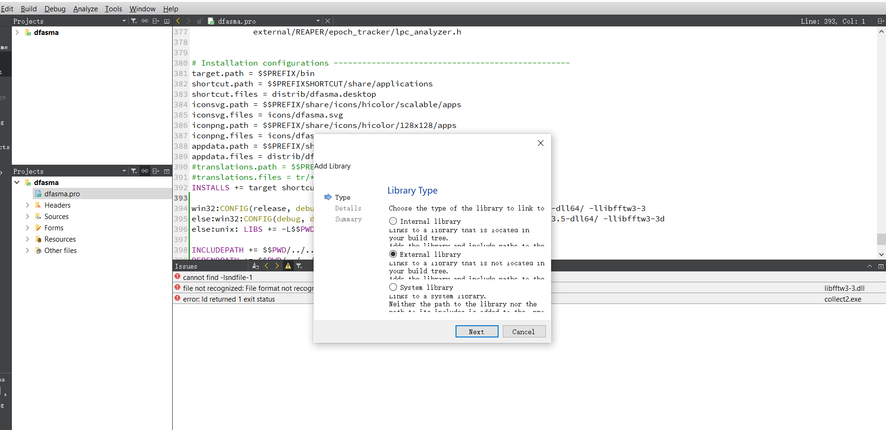
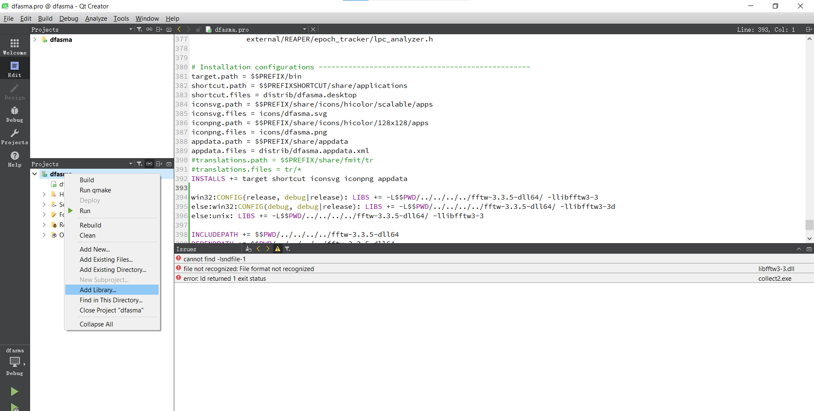
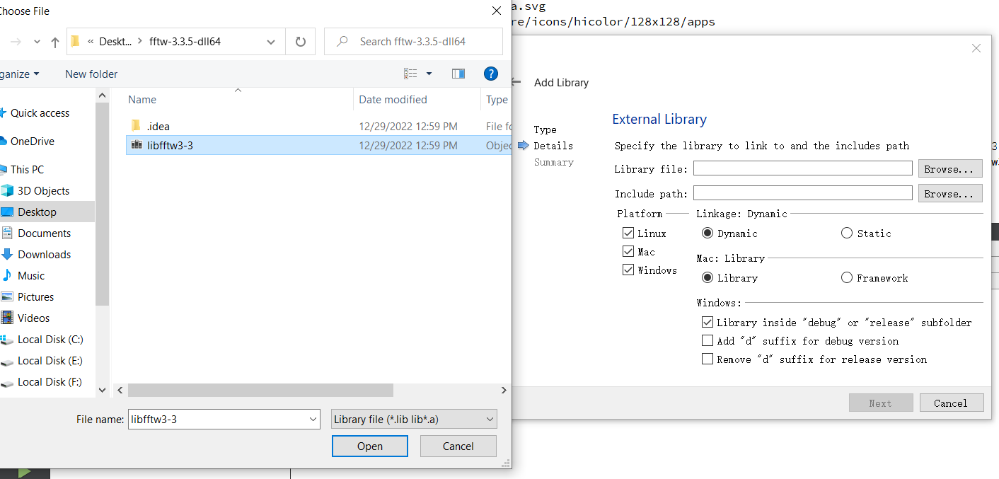

                                DFasma
           A tool to compare audio files in time and frequency
             http://gillesdegottex.gitlab.io/dfasma-website/


DFasma is an open-source software used to compare audio files in time and
frequency. The comparison is first visual, using wavforms and spectra.
It is also possible to listen to time-frequency segments in order to allow
perceptual comparison.

This software is coded in C/C++ using the Qt library (http://qt-project.org).
It is stored as a GitLab project (https://gitlab.com/gillesdegottex/dfasma).


### Goals

* The interface and the audio files should be loaded as quickly as possible.
* Any kind of lossless audio files should be easily loaded (it currently
  uses libsndfile, which support ~25 different formats).
* All features should run on Linux, OS X and Windows operating systems.
* Manage mono audio files (tracks of multi-channel files (e.g. stereo) can
  be loaded separately. A more advanced management of multi-channel files
  could be addressed in the future)
* Even though there are basic functionnalities to align the signals in
  time and amplitude, this software does not aim to be an audio editor.


### Legal

Copyright (c) 2014 Gilles Degottex <gilles.degottex@gmail.com>

This software is under the GPL (v3) License. See the file LICENSE.txt
or http://www.gnu.org/licenses/gpl.html
All source files of any kind (code source and any ressources), except
the content of the 'external' directory, are under the same GPL license.
Please refer to the content of the 'external' directory for the legal issues
related to those code source.

The icons are under the Creative Commons License
http://creativecommons.org/licenses/by/3.0/us/
Special acknowledgment to Dimitry Sunseifer for some of the icons.


### Disclaimer

THIS SOFTWARE IS PROVIDED BY THE COPYRIGHT HOLDERS AND CONTRIBUTORS "AS IS"
AND ANY EXPRESS OR IMPLIED WARRANTIES, INCLUDING, BUT NOT LIMITED TO, THE
IMPLIED WARRANTIES OF MERCHANTABILITY AND FITNESS FOR A PARTICULAR PURPOSE
ARE DISCLAIMED. IN NO EVENT SHALL THE COPYRIGHT OWNER OR CONTRIBUTORS BE
LIABLE FOR ANY DIRECT, INDIRECT, INCIDENTAL, SPECIAL, EXEMPLARY, OR
CONSEQUENTIAL DAMAGES (INCLUDING, BUT NOT LIMITED TO, PROCUREMENT OF
SUBSTITUTE GOODS OR SERVICES; LOSS OF USE, DATA, OR PROFITS; OR BUSINESS
INTERRUPTION) HOWEVER CAUSED AND ON ANY THEORY OF LIABILITY, WHETHER IN
CONTRACT, STRICT LIABILITY, OR TORT (INCLUDING NEGLIGENCE OR OTHERWISE)
ARISING IN ANY WAY OUT OF THE USE OF THIS SOFTWARE, EVEN IF ADVISED OF THE
POSSIBILITY OF SUCH DAMAGE.
ALSO, THE COPYRIGHT HOLDERS AND CONTRIBUTORS DO NOT TAKE ANY LEGAL
RESPONSIBILITY REGARDING THE IMPLEMENTATIONS OF THE PROCESSING TECHNIQUES
OR ALGORITHMS (E.G. CONSEQUENCES OF BUGS OR ERRONEOUS IMPLEMENTATIONS).
See the GNU General Public License (LICENSE.txt) for additional details.
# Git Clone
```
git clone -c core.symlinks=true ...  # not really work lols
```

GCC 11.3.0 for 64bits

```
nix-env -qaP dfasma

nix-shell -p dfasma
```

# Under Ubuntu's Dependencies

```
sudo apt-get install libfftw3-dev
sudo apt-get install libsndfile1-dev


```


<div align="center">
  
</div>


<div align="center">
  
</div>

This lib file was from:
1. Download and extract the file here: http://www.fftw.org/install/windows.html
2. Type: ```lib /machine:x86 /def:libfftw3-3.def``` in the terminal. (If 64 bit lib, just change the 86 into 64)
https://www.youtube.com/watch?v=geYbCA137PU&t=234s
<div align="center">
  
</div>

# The libsndfile audio package
https://blog.csdn.net/gongjianbo1992/article/details/98995983

https://codeantenna.com/a/HIUIhMvL5v


https://blog.51cto.com/u_15064642/3578491
